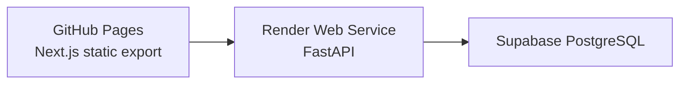

# University Materiality Platform

大學永續報告書利害關係人問卷與雙重重大性評估平台。前端可部署於 GitHub Pages；正式模式由 FastAPI + PostgreSQL / Supabase PostgreSQL 保存問卷資料。

## Modes

Demo Mode:

- `NEXT_PUBLIC_DEMO_MODE=true`
- 使用前端 demo data，不永久保存填答資料。
- 可用於 GitHub Pages 展示與操作示範。
- Demo 帳號只會在 `APP_MODE=demo` 且 `SEED_DEMO_ACCOUNTS=true` 時由後端建立。

Production Mode:

- `APP_MODE=production`
- 不建立 demo 帳號。
- 不使用 `admin123` / `survey123` 等預設密碼。
- `SECRET_KEY` 不可使用預設值，否則後端會拒絕啟動。
- 問卷資料寫入正式資料庫。
- 第一個 `super_admin` 可透過 `BOOTSTRAP_ADMIN_EMAIL` 與 `BOOTSTRAP_ADMIN_PASSWORD` 建立，密碼會雜湊保存。

## Roles

- `super_admin`: 建立、停用、重設管理者帳號；查看 `audit_logs`；管理全部問卷活動。
- `admin`: 建立問卷活動、管理議題庫、產生邀請碼、查看結果與匯出報告。
- `reviewer`: 只能查看儀表板與下載報告，不可修改資料，不可產生邀請碼。
- 填答者不需要正式帳號；專家填答者使用邀請碼。

## Survey Flow

Concern Survey:

- Frontend path: `/survey/concern`
- API: `GET /api/surveys/concern/current`, `POST /api/surveys/concern/submit`
- 不需登入、不需邀請碼。
- 填答者自行選擇利害關係人類別。
- 對各永續議題評估關注程度 1-5 分，並可填寫開放意見。

Expert Materiality Assessment:

- Frontend path: `/survey/expert`
- API: `GET /api/surveys/expert/current`, `POST /api/surveys/expert/draft`, `POST /api/surveys/expert/submit`
- 必須使用邀請碼。
- 邀請碼只能由 `admin` / `super_admin` 產生。
- 一組邀請碼預設只能填答一次。
- 邀請碼完整字串只會在產生當下回傳一次，資料庫只保存 HMAC hash 與 prefix。

## Database Tables

正式 schema 位於 `backend/schema.sql`。第二階段主要資料表：

- `users`
- `stakeholder_groups`
- `topics`
- `survey_campaigns`
- `concern_responses`
- `concern_topic_scores`
- `expert_assessment_responses`
- `expert_topic_scores`
- `invitation_codes`
- `audit_logs`
- `survey_drafts`
- `ai_analysis_versions`

舊版矩陣表 `survey_responses`、`topic_scores` 保留以維持第一階段相容性。

## API

Admin users:

- `POST /api/admin/users`
- `GET /api/admin/users`
- `PATCH /api/admin/users/{id}`
- `POST /api/admin/users/{id}/reset-password`

Campaigns:

- `POST /api/admin/campaigns`
- `GET /api/admin/campaigns`
- `PATCH /api/admin/campaigns/{id}`

Invitation codes:

- `POST /api/admin/campaigns/{id}/invitation-codes`
- `GET /api/admin/campaigns/{id}/invitation-codes`
- `PATCH /api/admin/invitation-codes/{id}/revoke`
- `POST /api/auth/invitation-login`

Surveys:

- `GET /api/surveys/concern/current`
- `POST /api/surveys/concern/submit`
- `GET /api/surveys/expert/current`
- `POST /api/surveys/expert/draft`
- `POST /api/surveys/expert/submit`

Exports:

- `GET /api/admin/export/concern-responses.xlsx`
- `GET /api/admin/export/expert-responses.xlsx`
- `GET /api/admin/export/anonymized-responses.xlsx`

Dashboard / materiality:

- `GET /api/analytics`
- `PATCH /api/admin/material-topics/{topic_id}/override`
- `GET /api/reports/materiality.docx`
- `POST /api/reports/materiality.docx`
- `GET /api/exports/materiality-matrix.png`

## Materiality Calculation

Impact Materiality:

- `positive_impact_score = occurrence_likelihood_score * positive_impact_magnitude_score / 5`
- `negative_impact_score = occurrence_likelihood_score * negative_impact_magnitude_score / 5`
- `impact_materiality_score = max(positive_impact_score, negative_impact_score)`

Financial Materiality:

- `financial_magnitude_score` is the average of valid scores for admissions / service revenue, reputation, operating cost, funding / subsidy and legal liability.
- `financial_materiality_score = financial_likelihood_score * financial_magnitude_score / 5`
- `null` means "unknown"; it is excluded from averages but included in unknown-ratio statistics.

Final material topics:

- A topic is material when `impact_materiality_score >= threshold` or `financial_materiality_score >= threshold`.
- `concern_score` is used for ordering and stakeholder concern evidence, not as the only decision rule.
- Admins may manually override final material topic status, but must provide a reason. Overrides are stored and written to `audit_logs`.

The materiality matrix uses:

- X axis: `financial_materiality_score`
- Y axis: `impact_materiality_score`
- Point size: `concern_score`
- Point color: E / S / G category

## Environment Variables

Frontend:

- `NEXT_PUBLIC_DEMO_MODE=true|false`
- `NEXT_PUBLIC_API_URL=https://<backend-domain>` (recommended) or `https://<backend-domain>/api`
- `NEXT_PUBLIC_SUPABASE_URL=<optional>`
- `NEXT_PUBLIC_SUPABASE_ANON_KEY=<optional>`

Backend:

- `APP_MODE=production`
- `DATABASE_URL=postgresql+psycopg://<user>:<password>@<host>:5432/<db>`
- `SECRET_KEY=<long-random-secret>`
- `ACCESS_TOKEN_MINUTES=120`
- `FRONTEND_URL=https://<github-pages-domain>/<repository-name>`
- `CORS_ALLOWED_ORIGINS=https://<github-pages-domain>`
- `SEED_DEMO_ACCOUNTS=false`
- First administrator: use `python -m app.create_admin --email <email> --name <name>`
- `OPENAI_API_KEY=<optional>`

## Local Test

Backend:

```powershell
.\backend\.venv\Scripts\python.exe -m pytest -q
```

Frontend, when global `npm` is unavailable:

```powershell
cd frontend
$env:PATH="C:\Users\Superuser\.cache\codex-runtimes\codex-primary-runtime\dependencies\node\bin;" + $env:PATH
.\node_modules\.bin\tsc.cmd --noEmit
.\node_modules\.bin\eslint.cmd . --max-warnings=0
.\node_modules\.bin\next.cmd build
```

## Deployment Notes

GitHub Pages:

- Keep GitHub Pages as frontend demo/static hosting.
- Demo deployment should set `NEXT_PUBLIC_DEMO_MODE=true`.
- Production frontend should set `NEXT_PUBLIC_DEMO_MODE=false` and `NEXT_PUBLIC_API_URL=https://<backend-domain>`.
- Static Pages cannot store formal survey responses by itself; production mode requires the backend API.

Backend:

- Deploy FastAPI to a server that can reach PostgreSQL / Supabase PostgreSQL.
- Apply `backend/schema.sql` or run SQLAlchemy table creation for a new database.
- Use a strong `SECRET_KEY`; production startup rejects the default key.
- Restrict CORS via `FRONTEND_URL` and `CORS_ALLOWED_ORIGINS`.
- Create the first administrator with `python -m app.create_admin`; rotate the temporary password after first login.

## Privacy And Security

- Passwords are saved as PBKDF2 hashes.
- JWT default lifetime is 120 minutes.
- Management APIs check role permissions.
- Invitation codes are not stored in plaintext.
- Audit logs are written for login, account management, campaign changes, invitation generation/revocation, exports and AI generation.
- AI analysis should only receive aggregated metrics and de-identified open answers; do not send names, emails, IPs or invitation codes.
- An anonymized Excel export is available for data sharing.

## 正式 MVP 部署

本階段部署架構：



正式網址規劃：

- Frontend: `https://jinhonju-dev.github.io/university-materiality-platform/`
- Backend API: `https://university-materiality-api.onrender.com`
- Health check: `https://university-materiality-api.onrender.com/health`

### Frontend: GitHub Pages

The frontend is exported as static files and deployed from `frontend/out`.

Required production build variables:

```env
NEXT_PUBLIC_DEMO_MODE=false
NEXT_PUBLIC_API_URL=https://university-materiality-api.onrender.com
PAGES_BASE_PATH=/university-materiality-platform
```

Notes:

- `NEXT_PUBLIC_API_URL` should point to the Render API root. The frontend automatically calls `/api/...` under that root.
- Do not set Supabase anon keys in the frontend for this MVP. The frontend talks only to FastAPI.
- Production Mode must not use `localhost` or `127.0.0.1`.
- Demo Mode is still available with `NEXT_PUBLIC_DEMO_MODE=true`, but it uses demo data and does not promise persistent storage.

GitHub Actions:

- Workflow: `.github/workflows/deploy-pages.yml`
- It runs backend tests, frontend type check, frontend tests, static build, then deploys to GitHub Pages.
- In repository Settings -> Pages, use GitHub Actions as the Pages source.
- Recommended repository Variables:
  - `NEXT_PUBLIC_DEMO_MODE=false`
  - `NEXT_PUBLIC_API_URL=https://university-materiality-api.onrender.com`

### Backend: Render FastAPI

Render Web Service settings:

- Root Directory: `backend`
- Build Command: `pip install -r requirements.txt`
- Start Command: `uvicorn app.main:app --host 0.0.0.0 --port $PORT`
- Health Check Path: `/health`

The repository includes `render.yaml` for blueprint-based setup. Set these Render environment variables:

```env
APP_ENV=production
APP_MODE=production
DATABASE_URL=<Supabase PostgreSQL connection string>
SECRET_KEY=<strong random secret>
FRONTEND_URL=https://jinhonju-dev.github.io/university-materiality-platform
CORS_ALLOWED_ORIGINS=https://jinhonju-dev.github.io
JWT_EXPIRE_MINUTES=120
SEED_DEMO_ACCOUNTS=false
OPENAI_API_KEY=
```

Security requirements:

- `SECRET_KEY` must be a strong random value. Production startup rejects `change-this-secret-in-production`, `local-development-secret`, and empty values.
- `SEED_DEMO_ACCOUNTS=false` in production.
- Do not use `admin123`, `survey123`, or any fixed default password.
- Do not commit `DATABASE_URL`, `SECRET_KEY`, or `OPENAI_API_KEY`.
- CORS should allow only the GitHub Pages origin for production.

### Supabase PostgreSQL

1. Create a Supabase project.
2. Open Project Settings -> Database.
3. Copy the PostgreSQL connection string.
4. Use the SQLAlchemy/psycopg form in Render:

```env
DATABASE_URL=postgresql+psycopg://<user>:<password>@<host>:5432/<database>
```

For a fresh MVP database, the FastAPI lifespan currently runs `SQLAlchemy create_all()` and seeds base lookup data. For a formal long-term deployment, use Alembic migrations instead of relying only on `create_all()`.

Initialize locally against a configured database:

```powershell
cd backend
$env:DATABASE_URL="postgresql+psycopg://<user>:<password>@<host>:5432/<database>"
$env:APP_ENV="production"
$env:APP_MODE="production"
$env:SECRET_KEY="<strong-random-secret>"
python -m app.create_admin --email admin@nuk.edu.tw --name 管理者
```

The command creates or resets an administrator, prints a one-time temporary password, and sets `force_password_change=true`.

### Local Deployment Test

Backend:

```powershell
cd backend
$env:APP_ENV="development"
$env:APP_MODE="demo"
$env:SECRET_KEY="local-development-secret"
$env:DATABASE_URL="sqlite:///./materiality.db"
uvicorn app.main:app --reload --host 127.0.0.1 --port 8000
```

Frontend static production build:

```powershell
cd frontend
$env:NEXT_PUBLIC_DEMO_MODE="false"
$env:NEXT_PUBLIC_API_URL="http://127.0.0.1:8000"
$env:PAGES_BASE_PATH=""
npm install
npm run typecheck
npm test
npm run build
```

Verify API wiring:

```powershell
Invoke-RestMethod http://127.0.0.1:8000/health
```

Expected:

```json
{"status":"ok"}
```

### Production Smoke Test

After Render deploys:

1. Open `https://university-materiality-api.onrender.com/health`.
2. Confirm it returns `{"status":"ok"}`.
3. Set GitHub repository variable `NEXT_PUBLIC_API_URL=https://university-materiality-api.onrender.com`.
4. Run the GitHub Pages workflow.
5. Open `https://jinhonju-dev.github.io/university-materiality-platform/`.
6. Confirm login and public survey pages call the Render API, not localhost.

API checks for the MVP:

- `GET /health`
- `POST /api/auth/login`
- `GET /api/surveys/concern/current`
- `POST /api/surveys/concern/submit`
- `POST /api/auth/invitation-login`
- `GET /api/surveys/expert/current`
- `POST /api/surveys/expert/submit`
- `GET /api/analytics`
- `GET /api/exports/responses.xlsx`

### Demo Mode vs Production Mode

Demo Mode:

- `NEXT_PUBLIC_DEMO_MODE=true`
- Uses frontend demo data.
- May show demo account hints.
- Does not guarantee persistent formal survey storage.

Production Mode:

- `NEXT_PUBLIC_DEMO_MODE=false`
- Calls Render FastAPI using `NEXT_PUBLIC_API_URL`.
- Stores data through FastAPI into Supabase PostgreSQL.
- Does not create demo accounts.
- Does not show default passwords.
- Does not use `localhost` or `127.0.0.1`.
